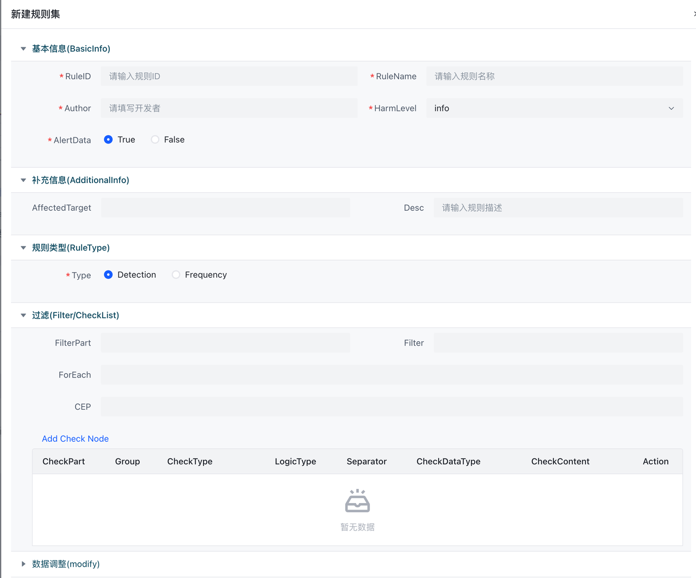
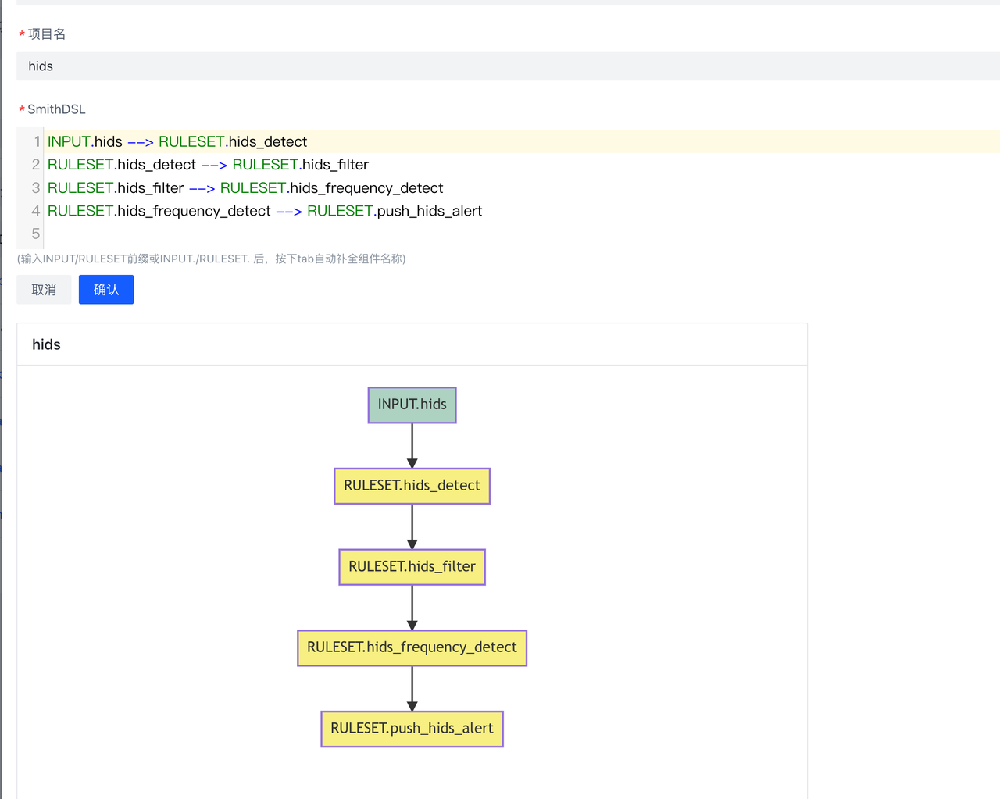
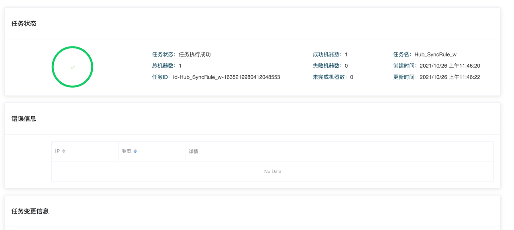
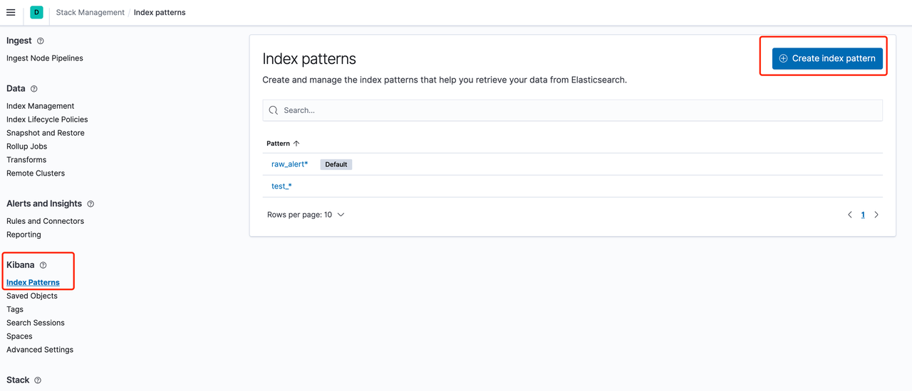
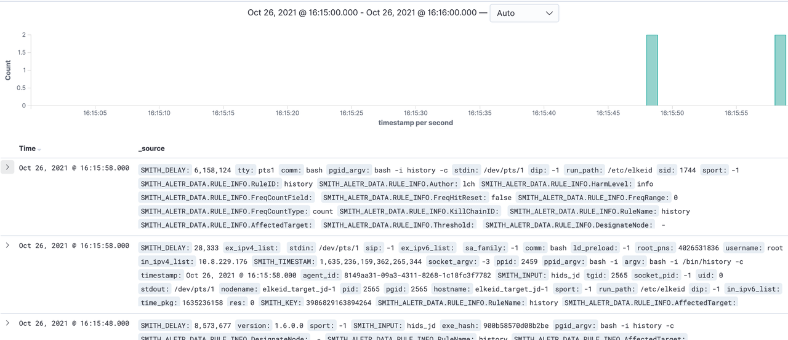
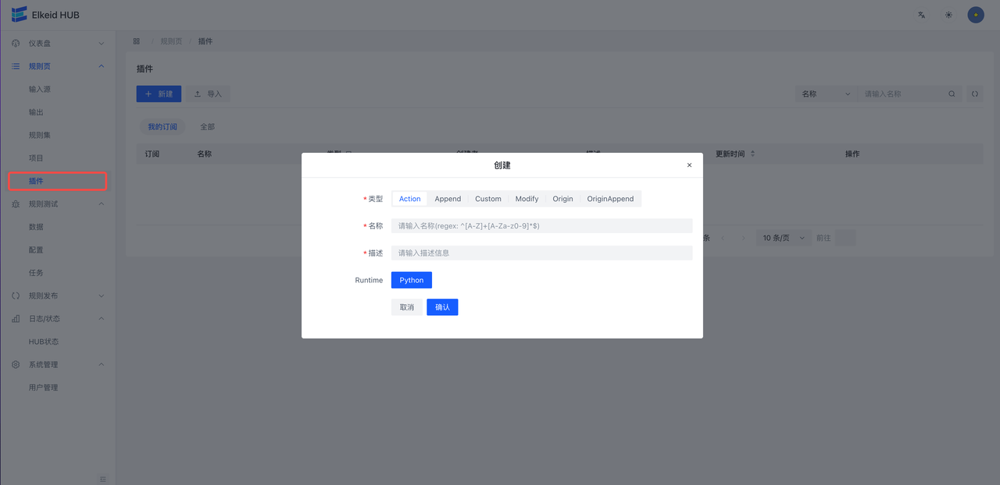
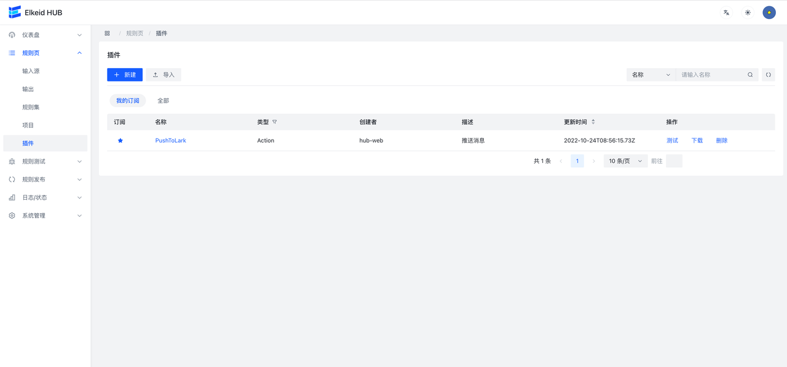
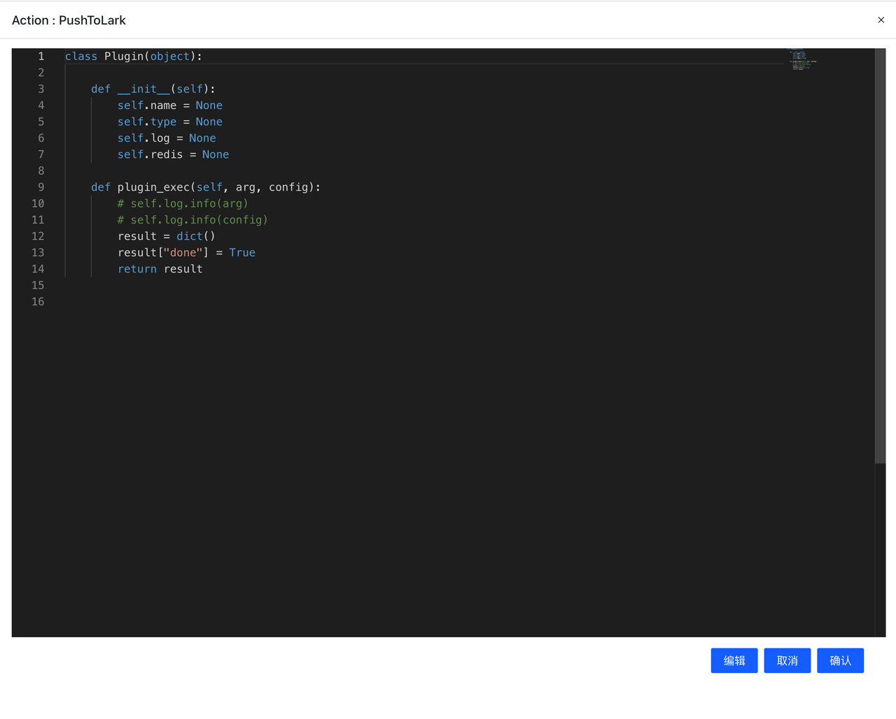
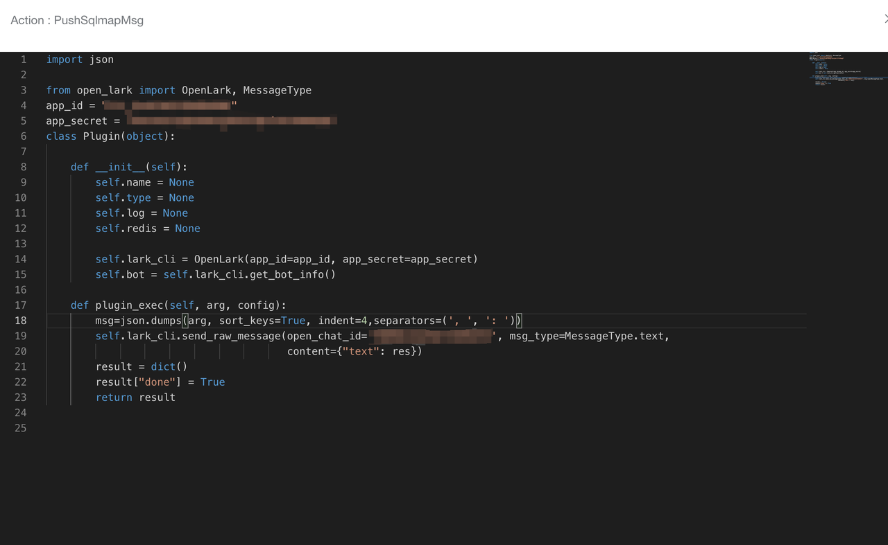

# Tutorial of Elkeid HUB Community Edition

## Before starting this tutorial

Please validate the following requirements：

- The HUB has been deployed correctly using elkeidup as per the deployment doc.
- There is at least one data input source (Input) and output source (Output) for data storage that can be used. In the HIDS scenario, the data input source is specified in the AgentCenter configuration file kafka, and the output source can be used ES or Kafka. In this tutorial, ES is used as an example.

E.g. community version default configured input source ( hids, k8s ) can be seen in the front end.

## Step 1. Access and log in to the frontend
The front end is accessed using the IP of the deployment front-end machine, and the login information is the username and password created for the elkeidup deployment.

## Step 2. Write a policy/rule

### Introduction to basic concepts
The RuleSet is the core part of HUB's implementation of detection/response. It can detect and respond to the input data according to business needs. With the plug-in, it can also directly push alarms or further process messages. Therefore, if there are additional business needs, you may need to write some rules yourself.
We use XML format to describe the rule set; RuleSet is majored categorized into two types **rule** and **whitelist**. The rule is those rulesets that detected data would continue to pass downstream, while **whitelist** is those rulesets that detected should not pass to downstream. Passing data downstream means the the data matches rules' expectations. In other words, data passing to downstream means its been detected or not whitelisted by certain rules.
A Ruleset can contain one or more rules, and the relationship between multiple rules is for 'OR 'relationship, which is been designed to make sure the single piece of data can Hit multiple rules at the same time.

### Writing rules with the front end
Go to Rules **Page - > Rule Set** Page, and you can see the current collection of RuleSet and all RuleSet.

When Type is Rule, it will appear **Discarded when undetected** field, which means whether it is discarded when undetected. The default is True, which means discarded when undetected, and not passed down. Here we set it to True. After creation, click the Rule button on the created entry to enter the Ruleset details. In the RuleSet details, click **New** The form editor will pop up.

HUB has opened dozens of rules by default, you can view the rules that have been written and write relevant strategies.

You can also follow [Elkeid HUB Community Edition User Guide](../handbook/handbook-zh_CN.md). After finishing writing, you can create a new project on the **project** page to combine the written rules with input and output.
The following figure is the process of CWPP alarm processing: the data is processed in the order of how DSL is written. INPUT followed by RULESET.hids _detect, and RULESET.hids _filter followed by other rules, and finally pushed to the CWPP console through RULESET.push_hids_alert.

After completing the above steps, enter the rule publishing page, which will display all the content of the modification just now. Each entry corresponds to a component modification; click Diff to view the modification details. After checking that it is correct, click Submit to send the changes to the HUB cluster.

After the task is submitted, it will automatically jump to the task details page to display the current task execution progress.

After the configuration is issued, you need to start the two newly created projects, enter the **Rules Publishing - > Project Operation** page, and start all existing projects respectively.

## Advanced operation

### Configure ES Index View Alarm

*This step applies to OutputType users using ES users, Kafka users can configure themselves.*

> It is recommended to use malicious behavior such as rebound shell to trigger the alarm flow, so that at least one piece of data can be entered first ES, so that the Kibana Index Pattern can be configured on the Kibana.
>

1. Configure the es type output on the output page, you can open AddTimestamp to help ES index your data with the input time order.

2. Edit the hids project and add the es output

3. Commit Changes

4. Now, lets getting to Kibana. First, enter ES stack management, select index patterns, click create index pattern

5. Enter the output index name that you filled in the ES output index name above, with an alert* as a prefix in this example.
    - If there is data in the index at this time (that is, the alarm flow has been triggered), it should be able to correctly match the configured index

6. configuration_time
    - If there is data in the index at this time (that is, the alarm flow has been triggered), then it should be able to correctly match the timestamp field, otherwise there will be no drop-down selection box here

7. To browse the data
    - Enter the discover dashboard, select the alert * dashboard you just created, adjust the time on the right, and you shall see the alarm that's generated

## Example

### Writing Sqlmap detection rules

In this tutorial, you will try to write a rule in the front end to check the rules that execute the Sqlmap command.
In this detection scenario, we only need to pay attention to **Execve** relevant information, so I added a filter field with data_type 59, so the rule will only process data data_type 59. After that, I added a CheckNode to check whether the argv field in the data contains 'sqlmap', and the finished effect is as follows:

You can see that three CheckNode are set to detect, one is to directly detect whether the argv contains Sqlmap, the other is to detect whether the exe field contains python , and the third is to use Regular-Expression to match whether it is a separate word. When these three are satisfied at the same time, an alarm will be triggered. After you finished writing, click Save.

We create a separate Output and Project for this test rule, as shown in the figure below:

Enter the testing environment to execute sqlmap related Instructions, add the corresponding index pattern in kibana add the corresponding index pattern in kibana, and wait for a while to find the corresponding alarm result.

You can see an alarm.

### Push Feishu plugin writing

Now that the rule is written, what if I want Feishu to remind me how to implement it when this event occurs? RuleSet does not support this function, you can achieve it by writing a plugin at this time.
create and use Python a Python plugin are as follows:

1. Click the Create button

2. Fill in the information as required

3. Click Confirm to complete the creation

4. Edit plugin
   Defaults to read-only state, need to click **edit** to edit

Click Save after editing

5. Add action to Rule

6. Same as policy release, publish the policy in the policy release interface

In this way, whenever the condition of this rule is triggered, this plugin will be called to alarm.

