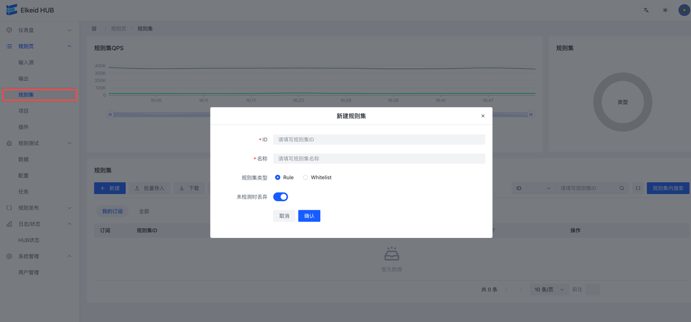
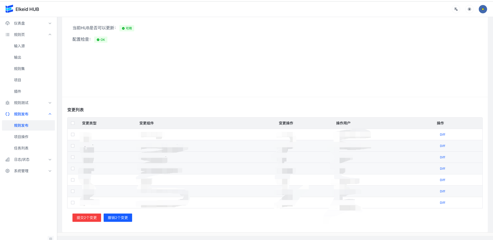
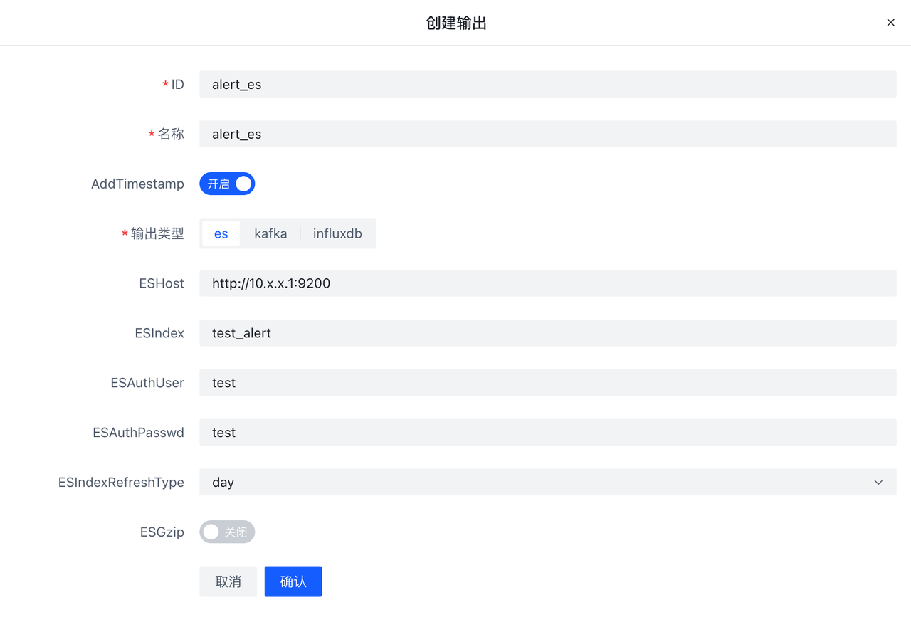
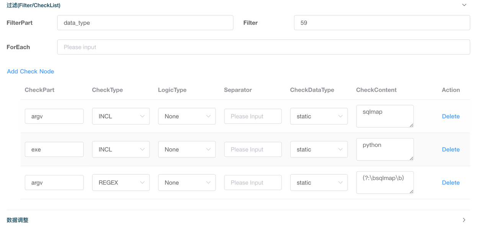
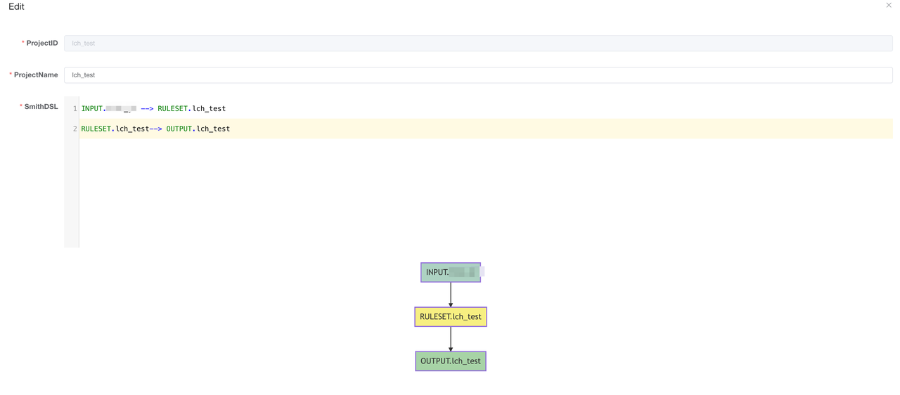
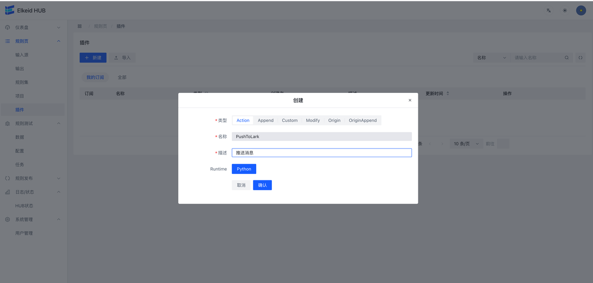

# Elkeid HUB 社区版快速上手教程

## 本教程的前置条件

在开始本教程之前，请检查：

- 已经按照部署文档,使用elkeidup正确部署了 HUB。
- 至少有一个可以使用的数据输入源（Input）和数据存储的输出源（Output）。在HIDS场景中，数据输入源为 AgentCenter 配置文件中指定的 kafka ，输出源可以使用 ES 或 Kafka ，本教程中以 ES 为例。

e.g. 社区版默认已配置输入源(hids,k8s)可在前端看到,方便测试使用

## Step 1. 访问并登录前端

使用部署前端机器的 IP 即可访问前端，登录信息为elkeidup部署创建的用户名和密码。

## Step 2. 编写策略

### 基本概念介绍

RuleSet是HUB实现检测/响应的核心部分，可以根据业务需要对输入的数据进行检测响应，配合插件还能实现报警的直接推送或对消息的进一步处理。因此如果有额外的业务需要可能需要自行编写部分规则。

RuleSet是通过XML格式来描述的规则集，RuleSet分为两种类型**rule** 和 **whitelist**。**rule**为如果检测到会继续向后传递，**whitelist**则为检测到不向后传递，向后传递相当于检出，因此whitelist一般用于白名单。

Ruleset里可以包含一条或多条rule，多个rule之间的关系是'或'的关系，即如果一条数据可以同时命中多条rule。

### 使用前端编写规则

进入**规则页->规则集**页面，可以看到当前收藏的RuleSet和全部RuleSet。

当Type为Rule时会出现**未检测时丢弃**字段，意味未检测到是否丢弃，默认是True即为未检测到即丢弃，不向下传递，在这里我们设为True。创建完成后，在创建好的条目上点击规则按钮，进入该Ruleset详情。在RuleSet详情中点击**新建**会弹出表单编辑器。

HUB已经默认开放了数十条规则,可以查看已经编写的规则,进行相关策略编写

也可以根据[Elkeid HUB 社区版使用手册](../handbook/handbook-zh_CN.md) 进行编写.编写完成后,可以在**项目**页新建project,将编写好的规则与输入输出进行组合.

下图即为hids告警处理的过程:数据按照dsl的顺序,依次经过RULESET.hids\_detect、RULESET.hids\_filter等规则进行处理,最后再通过RULESET.push\_hids\_alert推送到CWPP console.

完成以上步骤后，进入规则发布页面，会显示出刚才修改的全部内容，每一个条目对应着一个组件修改，点击 Diff 可以查看修改详情。检查无误后，点击提交，将变更下发到HUB集群。

任务提交后，会自动跳转到任务详情页面，显示当前任务执行进度。

配置下发完成后，需要启动刚才新建的两个项目，进入**规则发布->项目操作**页面，分别启动全部已有的 项目。

## 进阶操作

### 配置ES Index查看报警

*此步骤适用于OutputType使用ES的用户，Kafka用户可以自行配置。*

|建议先使用反弹shell等恶意行为触发一下告警流，让至少一条数据先打入ES，从而在Kibana上可以配置Index Pattern。|
| :- |
1. 在输出页配置es类型的输出,可开启AddTimestamp,方便在kibana页面配置相关索引

2. 编辑hids项目,加入刚编些好的es输出

3. 提交变更

4. 首先进入ES 的 stack management，选择kibana 的index patterns，点击 create index patten

5. 输入之前填入的ES output index name，以星号 \*  作为后缀，这里以默认推荐优先，分别为alert 或者 raw\_alert
   - 如果这时index中存在数据（即已经触发过告警流），那么应能正确匹配到alert或者 raw\_alert index

6. 配置时间字段
   - 如果这时index中存在数据（即已经触发过告警流），那么应能正确匹配到timestamp字段，否则此处无下拉选择框

7. 去浏览数据
   - 进入discover 看板，选择刚才创建的  alert\* 看板，调整右侧时间，即可看到告警

## 示例

### sqlmap检测规则编写

在本教程中，会尝试在前端中编写一条规则，为检查执行sqlmap命令的规则.

在该检测场景中，我们只需要关注**Execve**相关的信息，因此我添加了data\_type为59的过滤字段，因此该规则只会对data\_type为59的数据进行处理。之后我添加了一个CheckNode，检查数据中argv字段中是否包含'sqlmap'，编写完的效果如下：

可以看到分别设置了三个CheckNode来进行检测，一是直接检测argv中是否包含sqlmap，二是检测exe字段是否包含python，三是使用正则来进行匹配是否为单独的word，当这三个同时满足，就会触发报警，编写好后，点击保存。

我们单独为该测试规则建立一个Output和Project，如下图所示：

进入测试环境执行sqlmap相关指令，在kibana中添加对应的index pattern，稍微等待一会就可以找到对应的报警结果。

可以看到出现了报警。

### 推送飞书插件编写

规则写完了，如果我想在发生该事件的时候飞书提醒我该如何实现呢？RuleSet并不支持这项功能，此时可以通过编写插件来实现。

创建并使用Python 插件的步骤如下：

1. 点击创建按钮

2. 按照需求，填写信息

3. 点击确认，完成创建

4. 编辑插件

默认为只读状态，需要点击**编辑**才能进行编辑

编辑后点击保存

5. 在Rule中添加action

6. 同策略发布相同，在策略发布界面发布策略

这样每当这个rule的条件被触发，就会调用这个插件进行报警。

